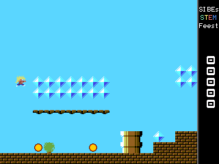
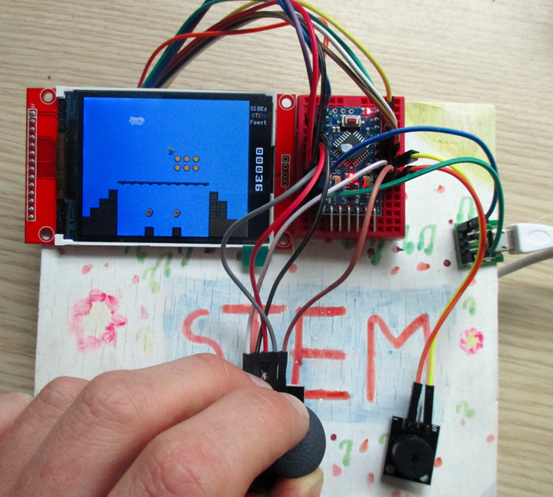
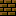

# Arduino Platformer Game with ILI9341 LCD

This is an implemenation of a simple side scrolling platformer game
running on an Arduino Atmega328 inspired by classic 80s games like
Giana Sisters or Super Mario Bros.



The game was written as a gift and introduction to programming and
Arduinos for my Son's 10th birthday, but it may be of interest to
others, so here goes..

# Hardware



I got the inspiration for this from [João Vilaça's](https://github.com/vilaca)
[Handheld-Color-Console](https://github.com/vilaca/Handheld-Color-Console),
so the hardware is very similar to that:

- [Arduino Pro Mini (3v3 / 8MHz)](https://www.arduino.cc/en/Main/ArduinoBoardProMini)
- [2.2" / 2.4" / 2.8" 240x320 SPI TFT module with ILI9341 controller](https://www.adafruit.com/product/2478)
- [KY-023 Joystick module](https://tkkrlab.nl/wiki/Arduino_KY-023_XY-axis_joystick_module)
- [KY-006 Buzzer module](https://tkkrlab.nl/wiki/Arduino_KY-006_Small_passive_buzzer_module)
- [Micro-B USB breakout module](https://www.adafruit.com/product/1833)
- USB power bank

In total, around 10-15 euros if sourced from Ebay or Aliexpress.

## Wiring

Wiring is idential to [João Vilaça's](https://github.com/vilaca)
setup, except that a USB power bank and Micro-B USB breakout is used
for power instead of a battery box and AA batteries.

### TFT

| Arduino | TFT      |
|---------|----------|
| Vcc     | Vcc      |
| Gnd     | Gnd      |
| 5       | CS       |
| 4       | RESET    |
| 6       | D/C      |
| 11      |SDI (MOSI)|
| 13      | SCK      |
| 9       | LED      |
| 12      |SDO (MISO)|

### Joystick

| Arduino | Joystick |
|---------|----------|
| Vcc     | +5v      |
| Gnd     | Gnd      |
| A0      | VRx      |
| A1      | VRy      |
| 2       | SW       |

### Buzzer

| Arduino | Buzzer   |
|---------|----------|
| Gnd     | Buzzer-  |
| 3       | Buzzer+  |


# Software

While the hardware is based on [João
Vilaça's](https://github.com/vilaca) work, the software has been
written from scratch. The main game logic is in `game.c`.

Like most of classic games, the rendering is structured around
*tiles*, E.G. 16x16 blocks of pixels.

The hardware scrolling feature of the ILI9341 is used to scroll the
background, so only a single column of background pixels (and the
player) needs to be redrawn when scrolling.

Because of the screen rotation (natively the panel is 240x320, but is
used in 320x240) we cannot limit the scrolling area horizontally like
it was done for the score in Giana Sisters. Instead a 32 pixel area to
the right is used to show the points. This leaves an active play area
of 288 x 240 pixels or 18 (288 / 16) x 15 (240 / 16) tiles.

The content of the world (E.G. background and powerups) is described
in a world map, E.G. a description of what graphics tile should be
rendered where and what should happen if the player enters the tile.

The world map and tile graphics is stored in flash (PROGMEM) to save
RAM, and the currently displayed part of the world is copied into RAM
for easier processing (see the `screen` array).

The world map and tiles are stored as 4 bits per pixel arrays, which
are generated from the PNG images under gfx/ by `png2h.py`. The player
and background tiles are 16x16 pixels. The world map is from
gfx/world.png, which makes is very easy to tweak the world map with
E.G. [The Gimp](https://www.gimp.org/): 

The 16 possible world map tile values are:

* 0: Background
* 1: Wall 
* 2: Tube 1 
* 3: Tube 2 
* 4: Square 
* 5: Bridge 
* 6: Tree 1 
* 7: Tree 2 
* 8: Cloud 1 
* 9: Cloud 2 
* 10: Unused
* 11: Unused
* 12: Diamond 
* 13: Coin    
* 14: Fries   
* 15: Donut   

And then a few tiles for the player (boy/girl) and digits for the
points.

At each frame of the game, the new player position and speed is
calculated based on gravity and joystick actions, and collissions with
the world are checked and resolved (for solid, E.G. tile 1..5) or the
points are updated and powerup removed (tile 12..15) based on world
map. Finally the screen is scrolled if needed.

Currently around 21KB of flash and 1090B RAM is used, so there's still
room for quite some additions.


## Building

[Arduino-Makefile](https://github.com/sudar/Arduino-Makefile) is used
to build the game. The grahics tiles under gfx/ are converted into the
native format using png2h.py, which needs [Python](http://www.python.org)
and [Python-Pillow](https://pypi.python.org/pypi/Pillow). On Debian
systems, doing the following should be sufficient:

```
sudo apt-get install arduino-mk python-pil
```

Once that is taken care of, building is simply:

```
make TARGET=arduino
make TARGET=arduino upload
```

See `make TARGET=arduino help` or the
[Arduino-Makefile](https://github.com/sudar/Arduino-Makefile)
documentation for further details.

## PC emulation

For ease of development the hardware can also be emulated on a
PC. This emulation needs [SDL 2.x](http://libsdl.org/). To Build,
simply do:

```
make TARGET=native
./emu
```

To run in fullscreen mode, export FULLSCREEN=1 to the environment:

```
FULLSCREEN=1 ./emu
```

The joystick is emulated by the arrow keys and space bar. Escape or Q
quits. Audio is currently not emulated.
